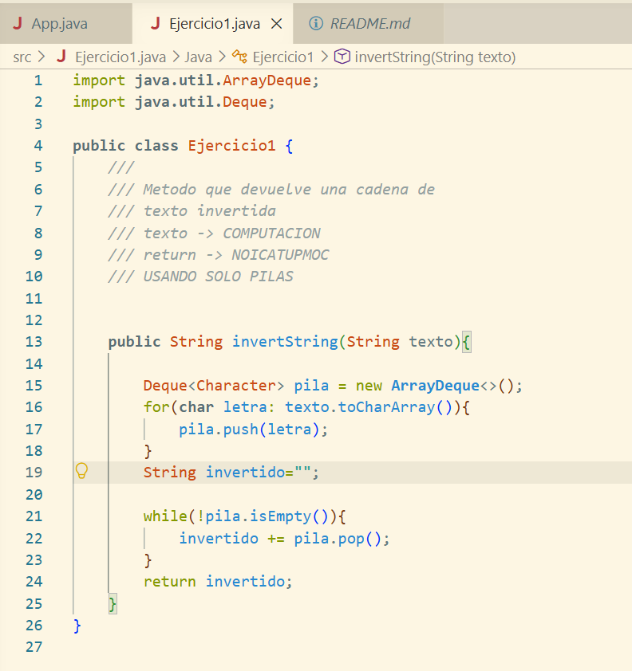
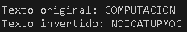
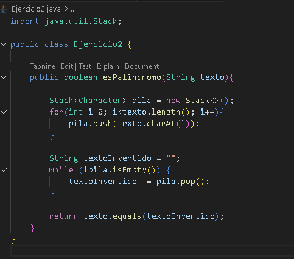
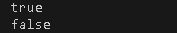

# Práctica de Estructuras de Datos en Java

**Nombre:** Emilio Montaleza
**Grupo:** 2
**Fecha:** 10/06/2026

## 1. Implementación de estructuras dinámicas lineales

**Fecha:** 08/06/2026

## Descripción

En esta práctica se implementaron diferentes estructuras dinámicas lineales utilizando Java. Se trabajó con **LinkedList**, **Queue**, **Stack** y **ArrayDeque** para comprender su funcionamiento y las operaciones básicas de inserción, consulta y eliminación de elementos. Mediante varios ejemplos se evidenció el comportamiento de las listas enlazadas, las colas siguiendo la política **FIFO (First In, First Out)** y las pilas siguiendo la política **LIFO (Last In, First Out)**. Además, se realizaron pruebas en consola para verificar el correcto funcionamiento de cada estructura de datos.

### Ejercicio 1: Invertir una Cadena

Se implementó un método llamado `invertString()` que recibe una cadena de texto y la devuelve invertida utilizando únicamente una pila como estructura auxiliar. Para ello, cada carácter es almacenado en la pila y posteriormente extraído para formar la cadena invertida.

**Ejemplo:**

```text
COMPUTACION
```

**Resultado:**

```text
NOICATUPMOC
```

## Imágenes

### Captura del código de implementación del ejercicio 1



### Captura de salida en consola



---

## 2. Ejercicio Palíndromo

**Fecha:** 10/06/2026

## Descripción

Se desarrolló el método `esPalindromo()` utilizando una pila para verificar si una palabra se lee igual de izquierda a derecha que de derecha a izquierda. El algoritmo almacena cada carácter del texto en una pila, genera una versión invertida de la palabra y finalmente compara ambos textos para determinar si son iguales.

**Ejemplo 1:**

```text
radar
```

**Resultado:**

```text
true
```

**Ejemplo 2:**

```text
computacion
```

**Resultado:**

```text
false
```

### Método implementado



### Captura de salida en consola




